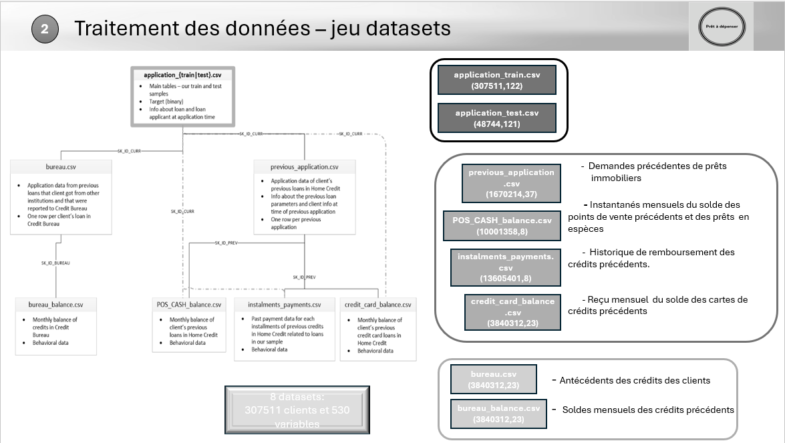
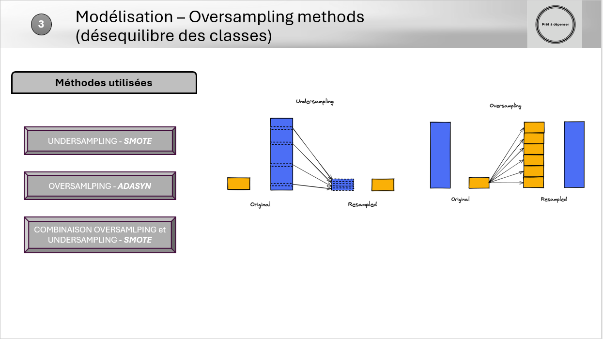
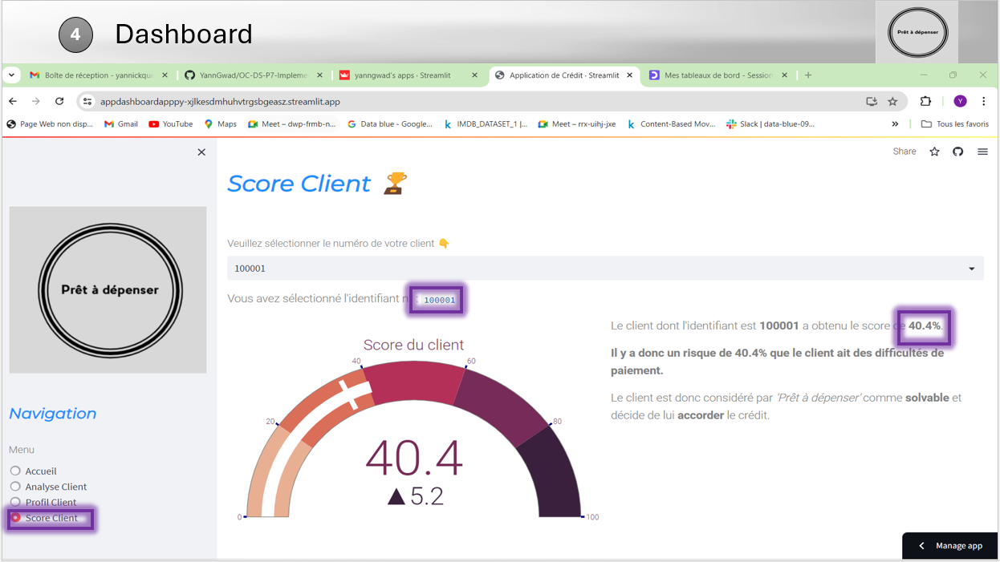
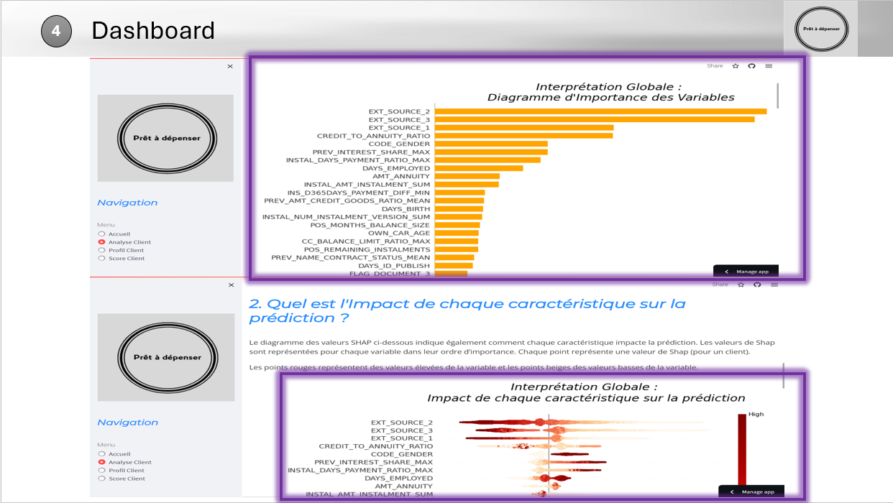
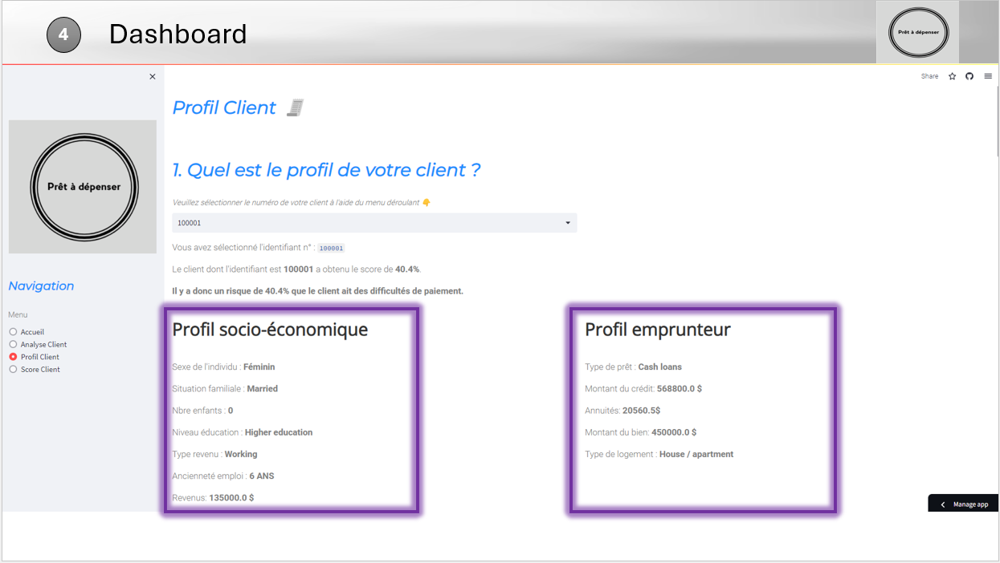

# OC-DS-P7-Implementez_modele_scoring_dashboard

## Description du Projet

Ce projet, partie du parcours "Data Scientist" d'OpenClassrooms, consiste à implémenter un modèle de scoring pour prédire la probabilité de défaut de paiement des clients d'une banque. L'objectif est de développer un modèle de machine learning performant, d'évaluer sa précision et de présenter les résultats de manière claire et concise.

## Objectifs du Projet

1. **Analyser les données** : Étudier les données fournies, comprendre leur structure et identifier les variables importantes.
2. **Préparer les données** : Nettoyer et prétraiter les données pour les rendre exploitables par les algorithmes de machine learning.
3. **Modéliser** : Implémenter plusieurs modèles de machine learning pour le scoring des clients.
4. **Évaluer les modèles** : Comparer les performances des modèles en utilisant des métriques appropriées.
5. **Interpréter et communiquer les résultats** : Présenter les résultats de manière compréhensible pour des non-experts.

## Source

[Source du projet](https://www.kaggle.com/c/home-credit-default-risk/data)

## Déroulement

### Modélisation
    
-   Schéma du déroulement de la phase de modélisation, de la compréhension du déséquilibre des classes, et du meilleur modèle retenu.

### Dashboarding

- Permettre de visualiser le score et l’interprétation de ce score pour chaque client de façon intelligible pour une personne non experte en data science.
- Visualiser des informations descriptives relatives à un client (via un système de filtre).

## Structure du Projet

1. **Contexte** :
    - Construire un modèle de scoring automatisé pour prédire la probabilité de faillite d'un client.
    - Développer un dashboard interactif pour les gestionnaires de la relation client permettant d'interpréter les prédictions du modèle et d'améliorer leur connaissance des clients.
2. **Traitement des Données** :
    - Analyse exploratoire des données (EDA)
    - Sélection et ingénierie des features
    - Nettoyage et prétraitement des données
    - Fusion des datasets
3. **Modélisation** :
    - Implémentation de plusieurs modèles (LightGBM, etc.)
    - Gestion du déséquilibre des classes (SMOTE, ADASYN)
    - Optimisation des hyperparamètres (Bayesian Optimization)
4. **Dashboard** :
    - Développement d'un tableau de bord interactif pour visualiser les résultats et interpréter les prédictions du modèle.
5. **Conclusion** :
    - Résumé des performances du modèle retenu et de son déploiement.

## Prérequis

- Connaissances en machine learning et data science
- Expérience avec Python et bibliothèques de data science (pandas, scikit-learn, etc.)
- Compétences en visualisation de données

